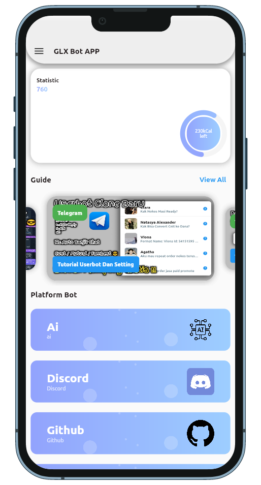

## GLX BOT APP   

GLX Bot Applikasi untuk menjalankan bot / userbot dari berbagai platform

  
## Download

<a href="https://play.google.com/store/apps/details?id=com"></img></a>

1. ANDROID
 
   - [BETA](https://github.com/azkadev/glx_bot_app/releases/download/beta/glx-bot-app-android.apk)
  
2. IOS

   - [BETA]()
  
3. MACOS

   - [BETA]()
  
4. Linux 
   - [BETA]()

5. Windows
   - [BETA]()

## Screenshot

|       SIGN IN PAGE        |            SIGN UP PAGE            |                 HOME PAGE |           Telegram Page            |
|:-------------------------:|:----------------------------------:|--------------------------:|:----------------------------------:|
|  |  |  |  |

## Tutorial

